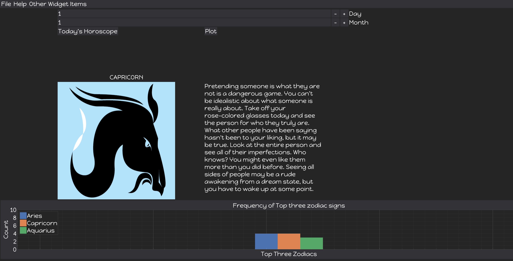

# DEARPYGUI VS TKINTER

 

DearPyGui and Tkinter are Python libraries that can be used to create interactive Graphical User Interfaces
in Python. 

  

> I created this demo for the Ottawa Python User Group meetup to highlight some of the differences between them, and to highlight how 
DearPyGui simplifies alot of the GUI creation process. 

In this project I created a Horoscope App. You enter your day and month of birth
and it returns your zodiac sign, an image of your zodiac sign and your horoscope. 

This is pulled from static content in the resources directory.

The DearPyGui frontend can be found in the dpg directory and the tkinter frontend can be found in the
tkinter directory. They both share a 'backend' in the resources folder.

 
NOTE: The *scale_factor* variable at the top of the dpg_main and tk_main modules allow you to adjust the GUI display size 
   based on screen resolution. For example. for 4k screens change it to 2
 

